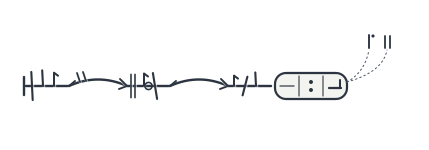
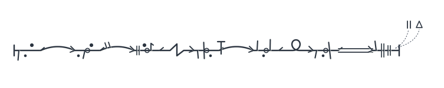
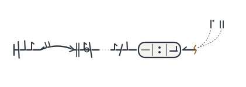
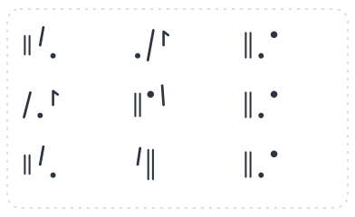
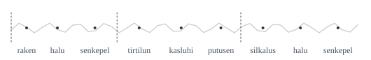

# The Engine — HEL's language as a working system

> **Authority C throughout.** A design proposal for approval, not canon. Nothing here
> resolves an Authority D question. The user answered the six Tier 1 questions on 13
> August 2026 and on 24 September asked for the language to be built out; this is that
> build, and it is a proposal like everything before it.

## 1. What changed

Phase 1 specified a language in prose: architecture A′ (`docs/arch/A-path-primary-notation.md`),
its Stratum III reserve, and a recommendation that approved four imports and refused
four features. Prose can say things a working system cannot do. **Phase 2 builds the
system and runs it**, and the documents are now held to what it does.

What exists now, all of it deterministic from one seed (1908):

| Piece | Where | What it does |
| --- | --- | --- |
| Phonology | `hel/phonology.py` | the forty-eight-syllable list, segmentation, the shape rules, the confusion table, IPA for the 1949 Standard and the Chicago Reading Room |
| Grammar | `hel/grammar.py` | every formative with its grade; the node-word template; bipartite edges; the anchor rule; 17 well-formedness and damage codes; gloss lines (A §6.3); the double-return readback (A §6.2) |
| Parser | `hel/parse.py` | transliteration to structure; Condition 1's assignability test; the Stratum III classifier |
| Lexicon | `data/core.yaml`, `hel/lexicon.py` | 43 analyzable roots and 4 ritual units; a commanded core that uses every syllable on the list exactly once as an initial |
| **The sealed key** | `sealed/` | the truth the corpus is rendered from — never shipped (§3) |
| World | `hel/world.py` | 360 loci over 31 five-year epochs, with the pinned places the documents name (the Long Wait, L-9, the Ladder's two nodes, Quiet Sixteen) |
| Renderer | `hel/render.py` | records rendered from the world under the sealed key |
| Taphonomy | `hel/taphonomy.py` | damage by stated rule, every loss logged (benchmark design rule 3) |
| Transcription | `hel/archive.py` | the 1908 Standard applied with its known errors: the Stratum II cut, the ADJ convention, copyists' h/k swaps, page-end *-ar* |
| Corpus | `hel/corpus.py` → `corpus/` | 558 accessions, 4,086 tokens, 308 registered units, numbered in the 1949 re-catalogue's accession order |
| Coinage and screen | `hel/coin.py`, `hel/screen.py`, `data/screen/` | coined forms screened before they exist (§5) |
| Poetics | `hel/poetics.py` | Stratum III texts composed by rule; CSC-1146 pinned verbatim |
| Stratum IV | `hel/stratum_iv.py` | the Ch-3 logs |
| Diachrony | `hel/diachrony.py` | the code's history 1908–1988 and the recitation's two branches (`docs/09-DIACHRONY.md`) |
| Field English | `data/field_english.yaml`, `data/wall.yaml`, `hel/field.py` | the human register, a naming generator, and a lament (`docs/10-FIELD-ENGLISH.md`) |
| Verifier | `hel/verify.py`, `data/claims.yaml` | every figure the documents state, checked against the corpus (§4) |
| Browser engine | `reading_room/engine.js` | a port of the parser, grammar, readback, pronunciation and the script renderer; cross-checked against the Python |
| The Reading Room | `reading_room/`, `tools/build_reading_room.py` | the published catalogue as a page (§7) |

**Three promises**, each enforced by code rather than by care:

1. **Every record is rendered, damaged and transcribed — never authored.** No object in
   the catalogue was written by hand except the ones the documents quote verbatim
   (Example 1, the Ladder, CSC-1146, the nine formulae), and those pass through the same
   pipeline.
2. **Nothing sealed ships.** The corpus export and the page build both refuse to write
   if any of 292 strings drawn from the sealed key appears in what they would publish.
3. **Every figure the documents state is checked.** 60 claims; the verifier exits
   non-zero if one fails.

## 2. Running it

```
python3 -m hel.corpus                 # world → records → damage → transcription → corpus/
python3 -m hel.verify                 # the documents' figures against the corpus
python3 -m hel.screen                 # the screen statement for every fixed form
python3 tools/lint_csc.py             # the flagship text and the reserve's arithmetic
python3 tools/build_reading_room.py   # reading_room/index.html
PYTHONPATH=. python3 -m unittest discover -s tests -p "test_*.py"
```

## 3. The pipeline, and the key it hides

```
sealed key ──► world (360 loci, 31 epochs) ──► render ──► damage ──► transcribe (1908 Standard)
                                                                          │
                     page ◄── export + leak check ◄── figures ◄── catalogue (1949 numbering)
```

**The sealed key** (`sealed/key.yaml`, `sealed/truth.json`) has three registers, kept
apart because they are different kinds of secret:

- **TRUTH** — what each root correlates with in the world (a feature, never a referent
  and never an author), whether the Archive's gloss is right, partial or wrong, and the
  verdict on each standing dispute where the world decides it. One dispute (Sturge
  1958) is **undecidable by construction**: no record carries a magnitude.
- **PRODUCTION** — how things were made, with no truth value at all: why the strata
  exist, how Stratum III texts are composed, where `[41]` is placed. These are the
  answers that must survive a Rosetta find, because there is nothing behind them to find.
- **WITHHOLDING** — every published gap, with what exists behind it and why it is
  withheld. A gap without an entry is a defect (benchmark F2).

Design decisions the documents did not make and the engine had to:

- **Reduced edges enter the next word** (F-04). With the head half gone, nothing written
  says which neighbour a Stratum II edge enters; the Standard transcribes every chain from
  its first tail-bearer.
- **Assignment goes through the register** (F-05). An incidence marker is assigned only
  when it is incident to a registered root.
- **The cartouche tie-break** (F-07). A vowel-initial destination that carries a
  coordinate keeps its head half, because the cartouche proves an edge arrives.
- **Counted records are rendered intact and travel on plates**, so the counts the
  documents state exactly are the counts the catalogue holds; label objects mark
  junctions; `[41]` sits on three Ch-1 objects (F-22).

## 4. What running it found

Twenty-four findings, numbered like catalogue entries: stable, never reused, gaps where a
finding was withdrawn. The full text of each — what the document said, what the engine
showed, the repair — is in `data/findings.yaml` and on the Reading Room's Findings tab.
Every document repair is marked **engine finding F-nn** in place.

**Contradictions in the Phase 1 documents, repaired in the text (14):**

| | Where | Finding |
| --- | --- | --- |
| F-01 | A §6.1b, §6.1d | Onsetless syllables licensed as "incidence markers only" make the ceiling 44, not 48, and leave Stratum II no vowel-initial roots |
| F-02 | A-reserve §4.6, §8.2 | "Functional units: 2.0 syllables, 11% coda-final" — no count gives it; Stratum III is the same length as the roots and differs in its ending |
| F-04 | A §3, §5.3 | Orientation-invariant reading fails for Stratum II transliterations |
| F-05 | A-reserve §8.2 | The positional defeat of the 1971 proposal would reject every label object |
| F-06 | A §10.1a | "Twenty-four are Strata II–III" — Stratum III cannot hold a bound pair |
| F-07 | A §4.3 | The 100% head-bearing figure includes the committee's cartouche tie-break |
| F-08 | A §6.1b; A-reserve §8.1, §10 | The forty-eight-syllable list is the Reformed List of 1988, not the 1908 list |
| F-09 | A §5.2a, §8, §12 | 419 multi-edge coordinate segments need more tokens than the functional strata hold |
| F-10 | A-reserve §4.2, §3.3 | 73% one-sequence types and P(elsewhere) = 0.04 cannot both be true; nor 24% and 0.58 |
| F-11 | A-reserve §4.1 | "6-unit provisionals" among the sequences not divisible by three |
| F-12 | A-reserve §4.4 | 88 · 9 · 3 does not follow from the reserve's own counts (90 · 8 · 3) |
| F-13 | A §6.1b | The stated vowel bands hold for the open syllables only |
| F-15 | A §2, §12; A-reserve | ~610 types with ~180 over five cannot fit the template at 4,100 tokens |
| F-28 | A §7 | "~40% of the hapax units" against the reserve's two-thirds (now seven in ten) |

**Where this build was wrong about itself (10):** F-14 (the 07 §7.3 table mixed in works
from the rejected architectures), F-21 (the build filed three Stratum III texts its own
classifier had rejected), F-22 (four exactly-stated figures not reproduced), F-25 (two
drafts of the recitation reconstruction withdrawn by the Algonquian check), F-26 (the
list can spell *sh* across a syllable boundary), F-27 (the regular Second-branch closure
marker is English *sin*), F-29 (four of the build's own coinages collided with
something), and three found by the blind trial (§8): F-30 (`[41]` and the ritual units
had patterns a reader could read), F-31 (the sealed key promised nine bound pairs the
build never rendered) and F-32 (the engine filed the Archive's own identified
constructions as damage, and eight glossed roots had no records).

**Withdrawn on review (6):** F-03, F-16 to F-20 — first logged as contradictions,
reclassified as calibration differences: the figure is feasible under the design and
this build's production rates give a different number.

### The verifier

`python3 -m hel.verify` checks 60 claims from `data/claims.yaml`:

| Status | Count | Meaning |
| --- | --- | --- |
| holds | 37 | the corpus reproduces the figure — including 23 half-negated edges, 27 *kalsira-ru* (3 completed, 24 frozen), 19 *lartuki-halu*, 34 stacked warrants with 11 reversed, `[41]` on three Ch-1 objects and all nine formulae, *-ar* on 111 intact Ch-1 objects, 74 of 79 Stratum III sequences divisible by three, 31 find loci, P(elsewhere) = 0.04, CSC-1146's 9 · 6 · 4, the confusion table (440 · 334), the grade preamble (10 · 15 · 9 · 1), the four strata shares, and every year the A-family cites present in the Archive of works |
| repaired | 15 | the figure contradicted the design; the text was corrected and the corpus reproduces the correction |
| calibration | 8 | feasible under the design; this build's rates differ, and the documents keep their figures |
| fails | 0 | |

The eight calibration differences, stated so nobody mistakes them for agreement: tokens
in sequences of three or more units (~2,900 said, 1,953 built); the longest sequence (41
units said, 21 built); the 1908 coda count (nine of ~90 said; the build reconstructs 3
of 47 roots and ritual units and not the formatives); the broken-half share (~41% said,
~26% built, because every counted record is rendered intact — A itself calls 41% an upper
bound — and 66 of the build's broken halves are the Archive's identified constructions);
SHUNT/RECUR edges (~380 said, 57 built); junction-map nodes (214 said, 173 built);
ADJ-only edges (87 said, 14 built); and the Stratum II environment (148 Ch-1 clusters
said, 9 built — the proportions A argues from are the rates the build uses).

## 5. The collision screen — statement

Per the standing rule at Phase 1 §4.5: **a statement of what was done, not a claim of
purity.** A process claim is falsified by one hit.

**Run:** 24 September 2026, by `hel/screen.py`, on every form coined for this build
before it existed, and on every fixed form: the 47 core and ritual units, 49 bound
formatives, CSC-1146 and its 1939 variant, 43 Second-branch forms, the Field English
loans, and 17 in-world names.

**Method.** Four tests, weighted by category (obscene, slur and Indigenous-structural
highest) and by position (free units harder than bound ones, A §6.1f): *exact*; a
*syllable-aligned substring* of three letters or more; *contains* an entry of four or
more; and *sounds-like*, on both strings folded into the code's sound space (voicing
neutralised, digraphs collapsed), at edit distance one. A match found only after folding
weighs one less than a match a reader would see in the letters.

**Lists.** Twelve files, 1,612 entries: English including British and North American
slang; Spanish, French, Portuguese and Italian; German, Dutch and the mainland
Scandinavian languages; Turkish; Hindi, Urdu and Punjabi; Arabic; Mandarin, Japanese
and Korean; brands and drug names; given names and prominent surnames; countries,
capitals and cities, with toponymic suffixes; Tolkien and other invented-world names;
Latin (prohibited shortcut #17). German, Turkish, Portuguese and the Scandinavian
languages are the gap A-reserve §10 asked Phase 2 to close; they are closed.

**The Indigenous-material screen is structural**, and it is run affirmatively on every
substrate form: no doubled vowel (it reads as length in double-vowel orthographies), no
excluded cluster, and — engine finding F-26 — no *s* coda before an *h* onset, which
spells *sh* and reads as the postalveolar the profile excludes. **It holds no Indigenous
word list, and none was compiled.** A lexical screen against Algonquian, Anishinaabe,
Potawatomi and Miami-Illinois material is work for a reviewer with community-sanctioned
resources; it is recorded here as a gap, not simulated.

**Coinage rejected in this build: 63 forms.** 26 structural (almost all the *sh*
junction), 16 comic (reduplications like *kaka*, *tutu*), 12 obscene, 4 slur, 3 loaded,
2 bodily. The rejected forms are listed in the build's author-side record.

**Fixed forms: hits disclosed and adjudicated.**

| Form | Hit | Adjudication |
| --- | --- | --- |
| `nikur` (A §5.2, PHASE.DISP.UNMEAS) | sounds like an English slur after folding voicing | The Standard form [niˈkuɹ] — final stress, pure vowels — is far from it; the Field English reduction [ˈnɪkəɹ] was not, so the loan keeps its Standard stress in the field (F-29). **Disclosed**; the form is in A and renaming it is the user's call |
| `sen` in the Second branch | the regular output is English *sin* | an irregular with a stated cause: the branch says *sen* (F-27) |
| *Vance* (A §4.6a, the 2004 recollation) | a sitting US public figure's surname | **Flagged for the user's decision.** It is a common surname and A uses it twice; the association is real and current |
| `pukal` | Hindi *pagal* ("crazy"), by sound | residual; weak |
| `hihar` (Second-branch *kihar*) | Arabic *himar* ("donkey", an insult); *Hisar* | residual; weak |
| `pekalar`, `pehisar`, `walnisen`, `munlisen`, `nulisar`, `tirakur` | Turkish *pekâlâ*; *Hisar*; *Nissen*; *Lise*; *Lisa*; *Iraq* by sound | residuals, as A-reserve §10 disclosed them, now confirmed against the extended lists |
| `lunpeki`, `nisarlu`, `siltoni`, `rukalti` | Turkish *peki*; *Nisha*; *Toni*; *Aldi* by sound | residuals |

**Renamed, because they were this build's own coinages** (F-29): the ritual unit
*ropelki* (it held *Opel* and *rope*) is now **rosilpe**; the root *hitulsa* (it held
*Tulsa*) is now **hitulke**; two invented scholars who shared names with a famous actor
and a novel's family are now **Treloar** (1926) and **Tredgold** (1967).

**Not screened:** Hebrew, Russian, Persian, Swahili, Tagalog, Vietnamese, Indonesian,
Greek, Polish and every language not named above. Stated as a gap.

## 6. The script

A §9's trace, drawn by `reading_room/engine.js`, with Phase 1's condition met: **a
distinct silhouette for every edge class and a fixed outer form for the cartouche.**
One continuous incised line; node words are notch clusters on it (one group per
syllable, the 1908 stipulation, and shapes fixed by the unit's identity, never by its
spelling — the trace carries no phonology); edges are the intervals between clusters.



*Example 1.* THRU (the arch with two ticks) from *harnuli* to *telnuro*, PASS (the plain
arch) to *kalsira*; the medial node is ringed; the cartouche's first compartment is
**ruled empty** — `hilun` — the second holds two dots (PASS.LATER), the third a
measured-ahead mark (`pukal`); the warrants `tir` and `lekur` are ticks on dotted
lead-lines off the line, which is why they are the first thing damage takes.



*The seven classes on one line:* PASS arch · THRU arch with ticks · SHUNT zigzag · BAR
arch with a T-bar · RECUR loop · BIND double line · then the stacked warrants. ADJ has no
drawn form of its own: it is what the Standard writes for an interval nobody can read
(Redfern's reading), and it renders as a dotted ochre gap.



*The reversal edit.* Move the PASS tail from *telnuro* onto *kalsira*, the word that
carries the coordinate, and carrier and anchor collapse into one word: the coordinate
stops composing (E-ANCHOR), and both halves of the old edge are left broken. The record
is reversible; the network is not.



*Stratum III: CSC-1146.* A field of marks with no line, no flicks and no cartouche,
inside the conservator's dashed boundary. The refrain `tirakur` is the same cluster three
times down the right-hand column, and `walnisen` opens the first and third rows. *A
damaged segment is a sentence with a hole in it. A Stratum III sequence is not a
sentence and has no hole* (A-reserve §2.2).



*Stratum IV: a Ch-3 log.* The sequence is recoverable and the shape is not, so it is
drawn as a tape, with frame ticks every three units.

## 7. The Reading Room

`reading_room/index.html`, built by `tools/build_reading_room.py`, published as an
artifact. Every accession in the catalogue with every layer derived live by the
browser engine — trace, transliteration, three pronunciations, gloss, readback,
operational English with its residue, findings — and a workbench where any segment can
be typed and read the same way; the formulae in three traditions with the branch
correspondences and a prediction game; Field English and the Reading at the Wall; the
figures, the verifier's table, the findings and the chronology. It carries nothing
sealed and says so in its footer, with the count of strings it was checked against.

## 8. The blind decipherment trial

Three independent readers — a philologist, a signals engineer and a skeptical auditor —
were given the published packet and nothing else, and every one of their 206 tool calls
was audited afterwards for paths outside it (none). Scored against the sealed key
(`critique/B1-blind-decipherment-trial.md`; raw reports in `critique/B1-trial/`):

- **The Etruscan condition held where it was designed to.** No root meaning came out:
  all three concluded, with statistics, that the roots have distributional roles and no
  recoverable reference. No Stratum III reading came out: all three recovered its form
  — about twenty repetition templates in a handful of families, which is the sealed
  composition procedure found from outside — and all three said no reading is
  supportable. **The undecidable dispute stayed undecidable**: all three said Sturge
  cannot be settled, for the key's reason.
- **Five disputes the world decides were decided**, correctly, by at least two readers
  each: Keele, Redfern, Stative over Locative, Cardwell, and Onslow (two classes).
  Hallam's Ch-1 half was found by all three and its Ch-2 half by none — the evidence is
  two tokens in fifteen hand copies, a calibration fault in the build. REG was found by
  no one, and its evidence is not in the published catalogue at all.
- **The trial's yield was four production defects** (F-30 to F-32): `[41]` and the
  ritual units carried patterns a reader could read; the sealed key promised nine bound
  pairs the build had never rendered; and the engine filed the Archive's own identified
  constructions as damage while eight glossed roots had no records. All fixed. The
  corrected corpus has not been re-trialled blind, and should be.

## 9. What is still open

- **Every Authority D question**, untouched: corpus scale (A §12 row 6), the source,
  the builders, whether anything is listening, what `[41]` is.
- **The approvals** 06 §8 asks for are still the user's to give.
- **The eight calibration differences** in §4 — each could be closed by tuning the
  build or by the user setting a figure; neither is an error.
- **The analyzable core.** The build carries 43 roots and 4 ritual units with ~49
  formatives (95 in all, matching A's "~90"); A's roots-only reading of "ninety" would
  need twice as many glossed roots.
- **A lexical Indigenous-material screen**, for a reviewer with community-sanctioned
  resources.
- **Vance** and **nikur** (§5), for the user's decision.
